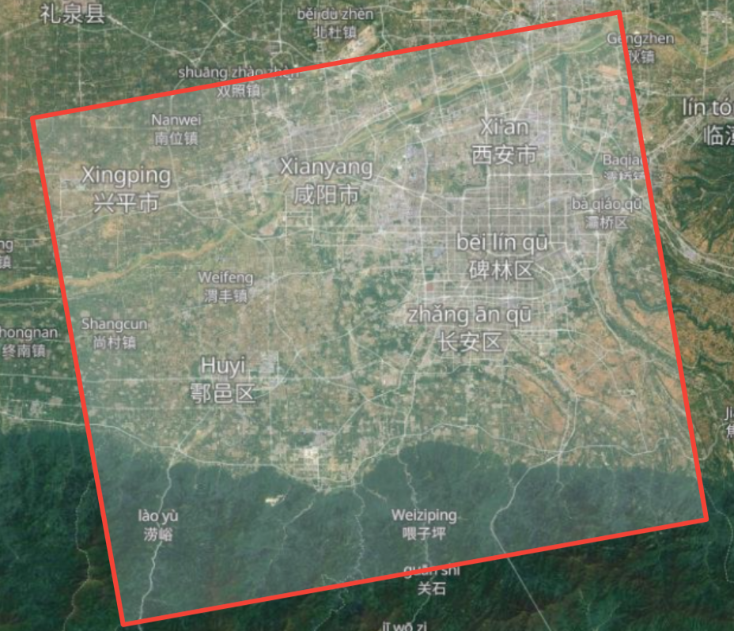
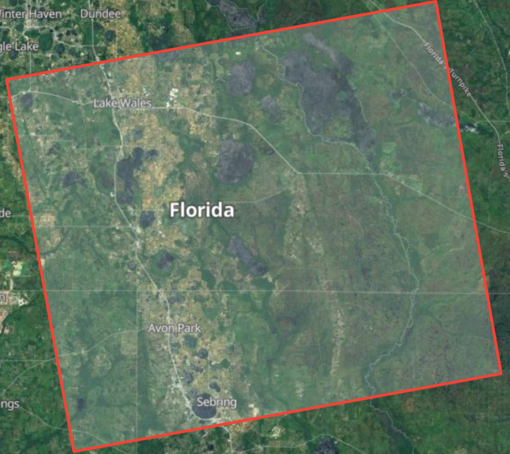
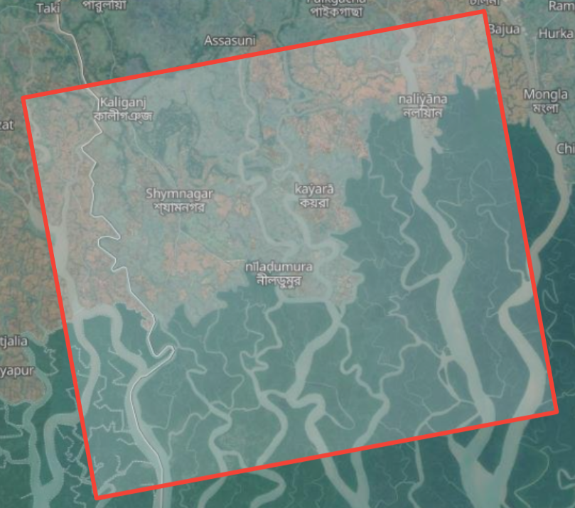
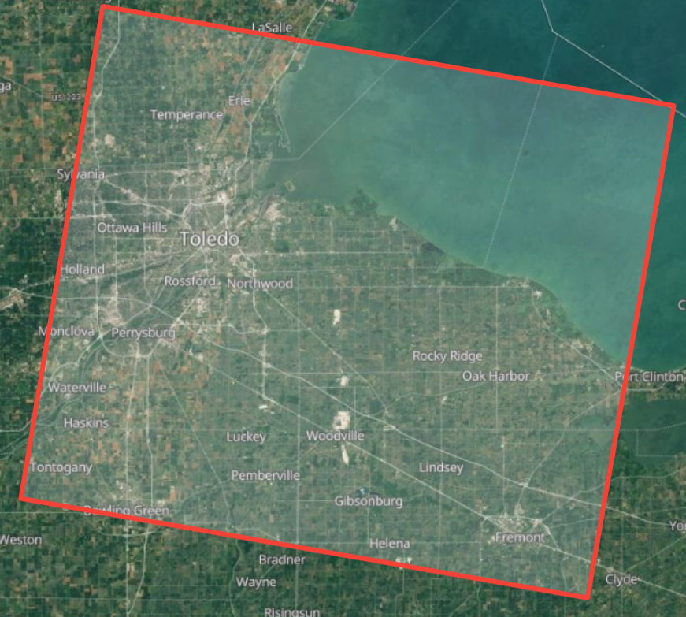
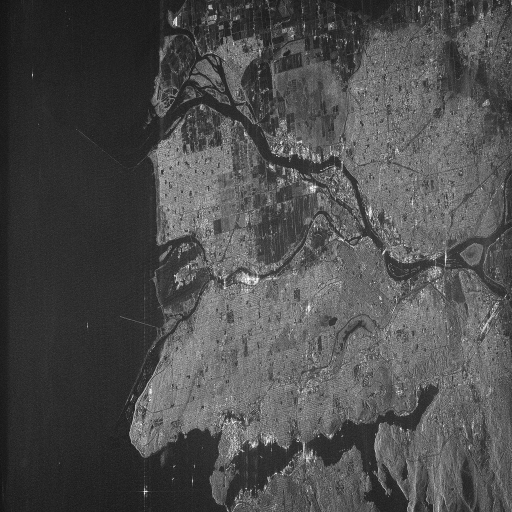
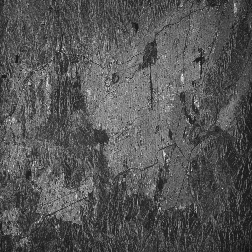

# Dataset

Please see [AutofocusSAR github](https://github.com/aisari/AutofocusSAR) or [AutofocusSAR webpage](https://aisari.iridescent.ink/AutofocusSAR/) for more details.

## ALOS PALSAR

### Obtain RAW SAR data

Nine RAW SAR images (L1.0) are acquired from [https://asf.alaska.edu/](https://asf.alaska.edu/). The data can be easily obtained by searching the scene name (ALPSRP020160970, ALPSRP054200670, ALPSRP103336310, ALPSRP110940620, ALPSRP115120970, ALPSRP268560540, ALPSRP269950430, ALPSRP273680670, ALPSRP278552780) in [https://search.asf.alaska.edu/](https://search.asf.alaska.edu/). The worldmaps of these images are illustrated as follows:

|                                                              |                                                              |                                                              |
| ------------------------------------------------------------ | ------------------------------------------------------------ | ------------------------------------------------------------ |
|  Vancouver, ALPSRP020160970 |  Xian, ALPSRP054200670 |  Hawarden, ALPSRP103336310 |
|  Hefei, ALPSRP110940620 |  Langley, ALPSRP115120970 |  Florida, ALPSRP268560540 |
|  Kaliganj, ALPSRP269950430 |  SimiValley, ALPSRP273680670 |  Toledo, ALPSRP278552780 |


## Making Dataset

The download nine sar raw images are imaged by Range Doppler Algorithm (RDA). Since the orignal image is very large, sub-region with size of $8192×8192$ is selected for each image. The selected regions are shown as follows: 

|   |   |   |
|---|---|---|
|  Vancouver, ALPSRP020160970  |  Xian, ALPSRP054200670  |  Hawarden, ALPSRP103336310  |
|  Hefei, ALPSRP110940620  |  Langley, ALPSRP115120970  |  Florida, ALPSRP268560540  |
|  Kaliganj, ALPSRP269950430  |  SimiValley, ALPSRP273680670  |  Toledo, ALPSRP278552780  |

Table3: Information of  selected regions.

| Number   | Scence name  | Area  | Lefttop pixel index  | Effective velocity(m/s)  | PRF(Hz) |
|---|---|---|---|---|---|
| 1  | ALPSRP020160970  | Vancouver  | (10000, 3600)  | 7153  | 1912.0459  |
| 2  | ALPSRP054200670  | Xi'an      | (16000, 1000)  | 7185  | 2159.8272  |
| 3  | ALPSRP103336310  | Hawarden   | (10000, 1000)  | 7211  | 2105.2632  |
| 4  | ALPSRP110940620  | Hefei      | (18000, 1000)  | 7188  | 2145.9227  |
| 5  | ALPSRP115120970  | Langley    | (10000, 2100)  | 7174  | 2155.1724  |
| 6  | ALPSRP268560540  | Florida    | (3000, 2000)   | 7190  | 2159.8272  |
| 7  | ALPSRP269950430  | Kaliganj   | (18000, 1000)  | 7195  | 2159.8272  |
| 8  | ALPSRP273680670  | SimiValley | (15000, 2000)  | 7185  | 2155.1724  |
| 9  | ALPSRP278552780  | Toledo     | (15000, 1000)  | 7178  | 2141.3276  |


The dataset can be downloaded from [BaiduYunPan](https://pan.baidu.com/s/1BW8ZsP2TXqNU1MJFQrzZBQ) (accessed on 13 August 2021), the extraction code is ``d7fk``.


# Citation

If you find the dataset is useful, please kindly cite our paper and star our pakcage [AutofocusSAR](https://github.com/aisari/AutofocusSAR) on GitHub:

```bib
@article{Liu2021Fast,
  title={Fast SAR Autofocus Based on Ensemble Convolutional Extreme Learning Machine},
  author={Liu, Zhi and Yang, Shuyuan and Feng, Zhixi and Gao, Quanwei and Wang, Min},
  journal={Remote Sensing},
  volume={13},
  number={14},
  pages={2683},
  year={2021},
  publisher={Multidisciplinary Digital Publishing Institute}
}
```


