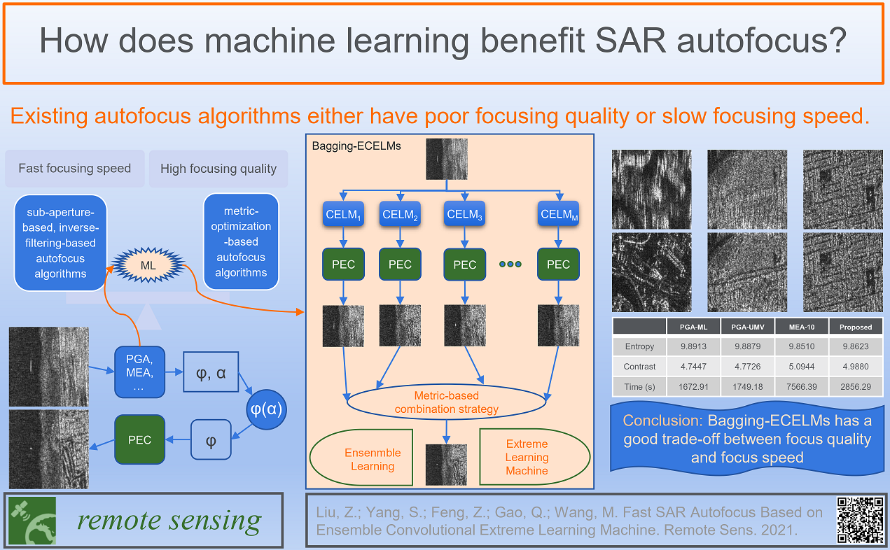

# ECELMs

This is a PyTorch implementation of paper "Fast SAR Autofocus based on Ensemble Convolutional Extreme Learning Machine".

Inaccurate Synthetic Aperture Radar (SAR) navigation information will lead to unknown phase errors in SAR data. Uncompensated phase errors can blur the SAR images. Autofocus is a technique that can automatically estimate phase errors from data. However, existing autofocus algorithms either have poor focusing quality or a slow focusing speed. In this paper, an ensemble learning-based autofocus method is proposed. Convolutional Extreme Learning Machine (CELM) is constructed and utilized to estimate the phase error. However, the performance of a single CELM is poor. To overcome this, a novel, metric-based combination strategy is proposed, combining multiple CELMs to further improve the estimation accuracy. The proposed model is trained with the classical bagging-based ensemble learning method. The training and testing process is non-iterative and fast. Experimental results conducted on real SAR data show that the proposed method has a good trade-off between focusing quality and speed.



# Training

```
python train.py
```

# Testing

```
python test.py
```

# Citation

If you find the dataset or this code is useful, please kindly cite our paper and star our pakcage [AutofocusSAR](https://github.com/aisari/AutofocusSAR) on GitHub:

```bib
@article{Liu2021Fast,
  title={Fast SAR Autofocus Based on Ensemble Convolutional Extreme Learning Machine},
  author={Liu, Zhi and Yang, Shuyuan and Feng, Zhixi and Gao, Quanwei and Wang, Min},
  journal={Remote Sensing},
  volume={13},
  number={14},
  pages={2683},
  year={2021},
  publisher={Multidisciplinary Digital Publishing Institute}
}
```


