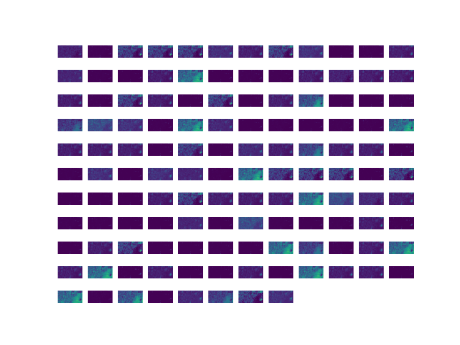
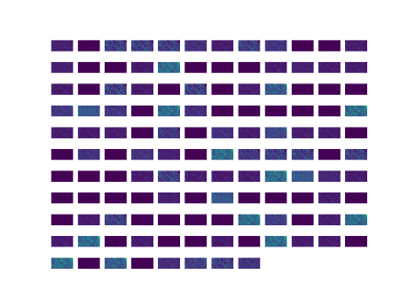

# PAFnet

This is a PyTorch implementation of paper "AFnet and PAFnet: Fast and Accurate SAR Autofocus Based on Deep Learning".

Autofocus plays a key role in synthetic aperture radar (SAR) imaging, especially for high-resolution imaging. In the literature, the minimum-entropy-based algorithms (MEA) have been proved to be robust and have been widely applied in SAR. However, this kind of method needs hundreds of iterations and is computationally expensive. In this paper, we proposed a non-iterative autofocus scheme based on deep learning and minimum-entropy criterion. It’s an unsupervised framework, which utilizes entropy as the loss function. In this scheme, deep neural networks are utilized for feature extraction and parameter estimation. Based on this scheme, two autofocus models (autofocus network and progressive autofocus network) are proposed. After training, the network learned the rules of autofocus from a large number of examples. Experimental results on real SAR data show that the proposed methods have focusing quality close to the state-of-the-art but with real-time focusing speed.

**This code open-sourced fully now!**

# Dataset

The dataset can be downloaded from [BaiduYunPan](https://pan.baidu.com/s/1BW8ZsP2TXqNU1MJFQrzZBQ) (accessed on 13 August 2021), the extraction code is ``d7fk``.


# Prepare

Please update the value of ``SAR_AF_DATA_PATH`` in 'data.yaml' to your dataset path.

Please install our newest version of package ``torchbox`` and ``torchsar`` by ``pip install torchbox torchsar``. 

# Training

```
python train.py --lr 1e-2 --num_epoch 1000, --device 'cuda:0'
```

# Testing

```
python test.py --model_file [TRAINED MODEL PATH] --device 'cuda:0'
```

# Visualization

The features of the above image extracted by AFnet (after 12-th layer) are shown as follows:

Features Extracted by Focuser0 Of Scene1


Features Extracted by Focuser0 Of Scene2



Features Extracted by Focuser0 Of Scene3




# Citation

If you find the dataset or this code is useful, please kindly cite our paper and star our pakcage [AutofocusSAR](https://github.com/aisari/AutofocusSAR) on GitHub::

```bib
@article{Liu2022PAFnet,
  title={AFnet and PAFnet: Fast and Accurate SAR Autofocus Based on Deep Learning},
  author={Liu, Zhi and Yang, Shuyuan and Gao, Quanwei and Feng, Zhixi and Wang, Min and Jiao, Licheng},
  journal={IEEE Transactions on Geoscience and Remote Sensing},
  year={2022},
  volume={60},
  number={},
  pages={1-13},
  doi={10.1109/TGRS.2022.3217063}
}

```


